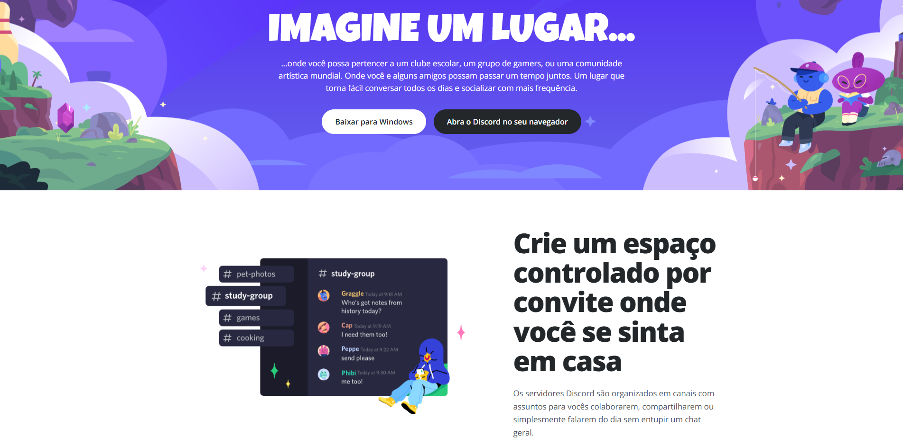

# Discord Landing Page — Desafio de Responsividade DIO

<p align="center">
  
</p>

<p align="center">
  Projeto desenvolvido como parte do desafio <strong>Construindo um Layout Responsivo Para o Site do Discord Com CSS</strong>, da plataforma <strong>DIO</strong>.
</p>

<p align="center">
  <a href="#-sobre-o-projeto">Sobre</a>&nbsp;&nbsp;&nbsp;|&nbsp;&nbsp;&nbsp;
  <a href="#-layout-responsivo">Layout Responsivo</a>&nbsp;&nbsp;&nbsp;|&nbsp;&nbsp;&nbsp;
  <a href="#-tecnologias-utilizadas">Tecnologias</a>&nbsp;&nbsp;&nbsp;|&nbsp;&nbsp;&nbsp;
  <a href="#-aprendizados">Aprendizados</a>&nbsp;&nbsp;&nbsp;|&nbsp;&nbsp;&nbsp;
  <a href="#-como-executar-o-projeto">Como executar</a>
</p>

---

## 📌 Sobre o projeto

Este projeto é uma landing page responsiva inspirada na plataforma **Discord**, desenvolvida com foco em praticar os principais conceitos de **HTML5**, **CSS3** e **responsividade**.

A proposta do desafio é reproduzir uma página baseada em um layout fornecido no Figma, aplicando boas práticas de estruturação, semântica, organização visual e adaptação para diferentes tamanhos de tela.

Além de seguir a proposta original, o projeto recebeu alguns ajustes visuais e estruturais para reforçar sua apresentação como peça de portfólio.

---

## 🎯 Objetivo do desafio

O principal objetivo foi construir uma interface responsiva utilizando apenas tecnologias fundamentais do front-end.

Durante o desenvolvimento, foram aplicados conceitos como:

- Estruturação semântica com HTML5;
- Organização de layout com CSS3;
- Uso de Flexbox;
- Responsividade com Media Queries;
- Adaptação de imagens para diferentes resoluções;
- Criação de seções reutilizáveis;
- Tipografia personalizada;
- Boas práticas de espaçamento, contraste e hierarquia visual.

---

## 🖥️ Layout Responsivo

O projeto foi desenvolvido considerando diferentes tamanhos de tela, garantindo uma boa experiência tanto em dispositivos desktop quanto em dispositivos móveis.

### Desktop

No desktop, o layout utiliza seções em duas colunas, combinando ilustrações e textos explicativos com espaçamentos amplos e boa hierarquia visual.

### Mobile

No mobile, as seções são reorganizadas em coluna única, mantendo a leitura confortável e evitando cortes ou sobreposição de conteúdo.

Foram realizados testes simulando dispositivos como o **Galaxy S20 Ultra**, ajustando:

- Tamanho dos títulos;
- Largura das imagens;
- Espaçamento entre elementos;
- Altura do hero;
- Comportamento dos botões;
- Fluxo visual das seções.

---

## 🚀 Tecnologias utilizadas

Este projeto foi desenvolvido com as seguintes tecnologias:


---

## 📁 Estrutura do projeto

```bash
discord-responsive-dio/
│
├── index.html
├── README.md
│
└── assets/
    ├── css/
    │   └── style.css
    │
    └── images/
        ├── hero-background.svg
        ├── section-01.svg
        ├── section-02.svg
        ├── section-03.svg
        ├── section-04.svg
        └── project-preview.png
```

---

## 🧩 Seções da página

A landing page é composta pelas seguintes seções:

### Hero

Seção principal com título de impacto, texto introdutório, imagem de fundo inspirada no Discord e botões de ação.

### Crie um espaço controlado por convite

Apresenta o conceito de servidores organizados por canais e comunidades.

### Aqui é fácil se encontrar

Mostra a facilidade de comunicação por voz entre amigos e participantes de um servidor.

### Para poucos e para muitos

Explica a possibilidade de organizar comunidades pequenas ou grandes com recursos personalizados.

### Tecnologia de conexão confiável

Destaca a experiência de voz e vídeo com baixa latência, aproximando os usuários em uma experiência mais natural.

---

## 📚 Aprendizados

Durante o desenvolvimento deste projeto, foram reforçados aprendizados importantes para a construção de interfaces modernas e responsivas.

Entre os principais pontos praticados estão:

- Como transformar um layout do Figma em código;
- Como organizar melhor a estrutura HTML;
- Como trabalhar com imagens exportadas;
- Como usar `background-image` corretamente no CSS;
- Como criar um hero responsivo;
- Como alternar layouts entre desktop e mobile;
- Como evitar textos espremidos em telas pequenas;
- Como usar `clamp()` para títulos mais flexíveis;
- Como aplicar `max-width` para controlar melhor imagens e textos;
- Como melhorar a experiência visual em dispositivos móveis.

---

## ⚙️ Como executar o projeto

Para executar o projeto localmente, siga os passos abaixo:

```bash
# Clone este repositório
git clone https://github.com/omarkfrank/discord-responsive-dio

# Acesse a pasta do projeto
cd discord-responsive-dio

# Abra o arquivo index.html no navegador
```

Também é possível executar utilizando a extensão **Live Server** no VS Code.

---

## 📸 Preview


---

## ✅ Status do projeto

✅ Estrutura HTML finalizada  
✅ Estilização CSS aplicada  
✅ Layout desktop implementado  
✅ Layout mobile ajustado  
✅ Responsividade testada  
✅ Projeto pronto para publicação

---

## 👨‍💻 Autor

Desenvolvido por **Mark Frank**.

[](https://github.com/omarkfrank)
[](https://www.linkedin.com/in/https://www.linkedin.com/in/omarkfrank//)
[](mailto:omarkfran.devk@gmail.com)

---

## 📝 Licença

Este projeto foi desenvolvido para fins educacionais como parte de um desafio da **DIO**.

Você pode utilizar este repositório como referência para estudos, desde que mantenha os devidos créditos.

---

<p align="center">
  Feito com dedicação, prática e evolução constante 🚀
</p>

---
